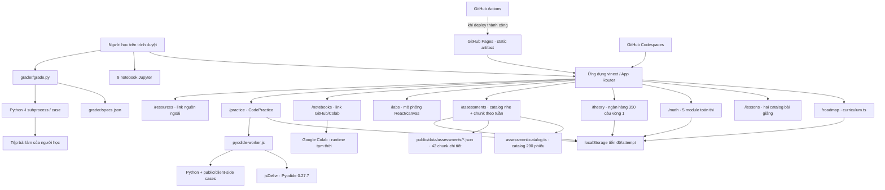

# Kiến trúc hệ thống VOAI Lab

Tài liệu này mô tả code đang có trong kho mã, không mô tả một LMS lý tưởng chưa
được triển khai. Hệ thống ưu tiên nội dung tĩnh, chạy cục bộ hoặc trên GitHub
Pages, minh bạch và không cần tài khoản ứng dụng. Đổi lại, tiến độ không đồng bộ
giữa thiết bị và các bài kiểm tra mù phía client chỉ có giá trị sư phạm.

## 1. Bức tranh tổng thể



Code Arena, assessment thủ công và CLI grader là ba luồng độc lập. Việc đạt một
trong 5 bài executable trên trình duyệt không tự tạo điểm CLI hay pass
assessment; pass tự đánh giá cũng không chạy code, không tạo điểm CLI và không
tự đánh dấu một phiên lộ trình.

## 2. Các lớp và nguồn sự thật

| Lớp | Tệp chính | Trách nhiệm |
| --- | --- | --- |
| Giao diện/route | `app/`, `components/` | Render trang, tương tác, lọc, quiz, canvas và editor |
| Lộ trình | `content/curriculum.ts` | 41 tuần, 290 phiên, milestone và ma trận 60 mục IOAI |
| Bài giảng lõi | `content/lessons-core.ts` | Nền tảng, khoa học dữ liệu, ML và DL |
| Bài giảng đa phương thức | `content/lessons-multimodal.ts` | CV, NLP, Audio, video/time-series và multimodal |
| Assessment 1:1 | `content/daily-assessments.ts` | Sinh và kiểm chứng 290 phiếu thủ công từ 290 curriculum session |
| Tách payload assessment | `content/assessment-catalog.ts`, `content/assessment-chunk-format.ts`, `scripts/emit-assessment-chunks.mjs` | Catalog nhẹ cho payload đầu; 42 chunk JSON tĩnh cho phần chi tiết |
| Tải chunk phía client | `lib/assessment-details.ts` | Cache theo module, gộp request trùng, từ chối dữ liệu lạ |
| Lý thuyết vòng 1 | `content/theory/` | 350 câu, blueprint đề mock và ba trục phân loại |
| Toán cho kỳ thi | `content/math/` | 5 module · 23 chủ đề · 69 bài luyện có đáp án số |
| Giao diện Toán | `components/MathExplorer.tsx` | Lọc theo mức độ, render KaTeX, tự chấm bài luyện, ghi tiến độ |
| Giao diện assessment | `components/AssessmentExplorer.tsx` | Lọc phiếu, nhập evidence/rubric, lưu nhiều attempt và xuất JSON |
| Mô phỏng | `components/InteractiveLabs.tsx` | 6 lab tính lại trong trình duyệt |
| Code arena | `components/CodePractice.tsx` | 5 đề executable mẫu, editor, test công khai/kiểm tra mù client-visible và ghi trạng thái đạt |
| Python trình duyệt | `public/pyodide-worker.js` | Tải Pyodide, chạy code/test ngoài main UI thread |
| Notebook | `notebooks/*.ipynb` | 8 bài thực hành có TODO, visible tests và exit ticket |
| Grader CLI | `grader/grade.py`, `grader/worker.py`, `grader/specs.json` | Chạy từng case trong subprocess và tính tối đa 45 điểm correctness |
| Build/runtime | `vite.config.ts`, `worker/index.ts`, `scripts/run-vinext.mjs` | vinext, Vite, Cloudflare worker và lệnh dev/build/start |
| Học/deploy GitHub | `.devcontainer/`, `.github/workflows/`, `next.config.ts`, `scripts/prepare-pages.mjs` | Codespaces, CI và artifact tĩnh cho repository `voai-lab` |
| Dữ liệu máy chủ | `db/`, `.openai/hosting.json` | Khung D1 tùy chọn; hiện chưa có bảng và chưa bật binding |

`content/curriculum.ts` tự kiểm tra các invariant khi module được nạp: đúng 41
tuần, 290 phiên và dải ngày liên tục. `docs/LO_TRINH_41_TUAN.md` là bản đọc dài
dành cho con người; khi thay đổi lịch, phải giữ dữ liệu TypeScript và tài liệu
đồng bộ.

## 3. Runtime website

`package.json` yêu cầu Node.js từ 22.13.0. Ba script chính gọi binary vinext qua
`scripts/run-vinext.mjs`:

```text
npm run dev    -> vinext dev
npm run build  -> vinext build
npm run build:pages -> vinext build tĩnh + chuẩn hóa artifact Pages
npm start      -> vinext start
```

`vite.config.ts` ghép vinext, Sites plugin và Cloudflare Vite plugin. Worker ở
`worker/index.ts` chuyển phần lớn request cho vinext App Router và có nhánh tối
ưu ảnh tại `/_vinext/image`.

Hiện `.openai/hosting.json` có `d1: null` và `r2: null`; `db/schema.ts` trống.
Vì vậy không được mô tả hệ thống như đã có account, database, cloud backup hoặc
đồng bộ tiến độ. `db/index.ts` chỉ là helper sẽ báo lỗi nếu code cố dùng binding
`DB` khi binding chưa tồn tại.

Bản phát hành GitHub tĩnh không cài CLI migration và không giữ
`drizzle.config.ts`. Nếu sau này bật D1, cần chọn/cài lại công cụ migration, thêm
cấu hình tương ứng và kiểm tra workflow triển khai trước khi tạo hoặc áp dụng SQL.

Khi `GITHUB_PAGES=true`, `next.config.ts` bật static export và asset prefix
`/voai-lab`; `scripts/prepare-pages.mjs` kiểm đủ route rồi tạo cấu trúc
`route/index.html` cùng `.nojekyll`. Workflow trong `.github/workflows/`
chạy các cổng chất lượng và có job deploy Pages; `.devcontainer/` cấu hình
Codespaces. Đây là năng lực có trong source, không phải bằng chứng repository đã
bật Pages hoặc URL công khai đã tồn tại. Trạng thái deploy chỉ được xác nhận từ
job **Deploy GitHub Pages** thành công và URL environment của chính repository.
Runbook nằm ở [Học online bằng GitHub](GITHUB_ONLINE.md).

## 4. Route và hành vi phía client

### `/roadmap`

Server page truyền dữ liệu lộ trình cho `RoadmapExplorer`. Client cho phép:

- xem 41 tuần hoặc ma trận 60 mục IOAI;
- tìm theo tiêu đề/focus/syllabus và lọc domain;
- mở 7 phiên của mỗi tuần;
- đánh dấu/bỏ đánh dấu một phiên;
- xuất một snapshot tiến độ JSON.

Ma trận chỉ nói một mục đã được **lên kế hoạch bao phủ**. Nó không suy ra mastery
và không kiểm tra artifact.

`content/week-lectures.ts` ánh xạ đủ 41 tuần tới các bài giảng khuyến nghị;
`RoadmapExplorer` tạo deep-link `/lessons?lesson=<id>` và
`LessonsExplorer` chọn ID hợp lệ đó. Đây là ánh xạ theo tuần. Nó không tạo quan
hệ 1:1 giữa 205 phiên loại `lesson` và 78 record bài giảng; outcome/kế hoạch
của từng phiên vẫn là nguồn sự thật cho artifact trong ngày.

### `/lessons`

Server chuẩn hóa hai schema bài giảng về `LessonViewModel`, sau đó truyền cho
`LessonsExplorer`. Giao diện có tìm kiếm, lọc domain, năm tab nội dung và quiz
phải trả lời trước khi đối chiếu.

Chuỗi `hiddenTestIdeas` không được truyền sang client; client chỉ nhận
`hiddenCount` để báo số nhóm test. Tuy nhiên người có quyền đọc kho mã vẫn nhìn
được catalog nguồn. Đây là tài liệu học cục bộ, không phải bí mật thi.

Trạng thái chọn bài, tab và câu trả lời quiz chỉ nằm trong React state. Tải lại
trang sẽ đặt lại; hệ thống không ghi điểm quiz vào tiến độ.

### `/math`

Năm module toán — đại số tuyến tính, giải tích/gradient, xác suất–thống kê, tối
ưu, và đo lường (thông tin · chỉ số · độ phức tạp). Phạm vi được cắt theo đúng
một tiêu chí: mỗi chủ đề phải nêu được `examUse`, tức chỗ kiến thức đó xuất hiện
trong đề hoặc trong đoạn code phải viết. Cổng dữ liệu ở `content/math/index.ts`
từ chối chủ đề bỏ trống trường này.

Mỗi chủ đề có công thức (render bằng KaTeX **phía server**, nên đọc được cả khi
JS chưa chạy), ví dụ giải mẫu từng bước, danh sách bẫy, và bài luyện đáp án số.
Bài luyện chỉ mở lời giải **sau khi** người học nhập một số đọc được —
`checkDrillAnswer` phân biệt ba trạng thái “chưa trả lời / đúng / sai”.

`tests/math-content.test.mjs` tính lại độc lập toàn bộ đáp án số từ định nghĩa
và bắt buộc mỗi bài luyện phải có một phép tính lại tương ứng, nên không thể
thêm bài mới mà quên kiểm.

Component client chỉ import `content/math/check-answer.ts` (không mang dữ liệu);
nội dung đi qua RSC props. Import thẳng `content/math` sẽ gói cả lớp Toán vào
bundle JS và người học tải hai lần.

### `/theory`

Ngân hàng 350 câu cho vòng 1, chia theo ba trục: mục syllabus, mức độ và dạng
câu. `lib/theory-exam-state.ts` giữ toàn bộ logic thuần — `evaluateGates()` là
**verdict duy nhất** của dự án (ba ngưỡng 75/60/50 chỉ tồn tại ở
`MOCK_INTERNAL_GATES`), `secondsLeftUntil()` suy đồng hồ từ deadline tuyệt đối,
và `parseActiveAttempt()` khôi phục bài đang làm sau reload. Đáp án chế độ Luyện
tập và chế độ Thi thử được giữ trong hai kho tách hẳn nhau.

### `/assessments`

Payload đầu chỉ mang **catalog nhẹ** (`ASSESSMENT_CATALOG`): đủ để liệt kê, lọc,
dựng bản nháp rỗng và kiểm định lịch sử attempt. Phần chi tiết — đề bài, tiêu
chí, câu retrieval, pass rule, mastery — nằm trong 42 chunk JSON tĩnh dưới
`public/data/assessments/`, sinh bởi `scripts/emit-assessment-chunks.mjs` trong
mọi chế độ chạy của `scripts/run-vinext.mjs`.

Chi tiết của phiên đầu tiên được gửi kèm trong payload nên màn hình đầu không
chờ mạng; chọn một phiên khác mới kéo chunk của tuần đó, đúng một lần cho mỗi
phiên trình duyệt. Khi chunk tải hỏng, phần tiêu đề và **lịch sử attempt vẫn
render** còn biểu mẫu bị khoá kèm nút thử lại — bản nháp không mất.

Hệ quả cần nhớ khi sửa: catalog phải luôn mang đủ `retrievalCount`,
`scoreWeights`, `minimumScore` và `minimumSectionScores`. Thiếu chúng thì lịch sử
attempt phụ thuộc vào mạng, và đó chính là lý do lần refactor đầu tiên phải hoàn
nguyên.

Server chỉ chấp nhận query
`?session=<session-id>` khi ID đó tồn tại. Validation ở module nội dung kiểm tra
quan hệ 1:1 với curriculum, ID và ngày duy nhất; validation này kiểm tra cấu
trúc dữ liệu, không chấm bài người học.

`AssessmentExplorer` cho phép tìm/lọc theo loại phiên và domain, rồi nhập:

- câu trả lời retrieval;
- mô tả bằng chứng code/test và link artifact tùy chọn;
- phần giải thích bắt buộc;
- điểm tự chấm cho retrieval, coding, validation và explanation;
- hai xác nhận SOLO-90 và không vi phạm automatic-fail.

Khi submit, client suy ra `incomplete`, `needs-revision` hoặc `passed` từ các
trường bắt buộc, tổng điểm người học tự nhập so với threshold và sàn điểm của
từng hạng mục trong `minimumSectionScores`. Điểm cao ở một phần không thể bù
cho retrieval/coding/validation/explanation dưới sàn. Đây là
formative/manual evidence: route không thực thi code, không mở/xác minh link và
không tự chứng minh correctness. Một session có thể giữ nhiều attempt; nút xuất
tạo `voai-assessment-attempts.json`.

Bản nháp chưa submit được cất theo `sessionId` vào `voai-assessment-drafts-v1`,
nên đổi phiếu hay reload **không** làm mất phần đang gõ (ASSESS-P2-01). Nháp chỉ
bị xoá sau khi phiếu đó đã submit thành công.

### `/labs`

`InteractiveLabs` dùng React state, canvas và phép tính JavaScript để mô phỏng
gradient descent, k-NN, convolution, attention, waveform/DFT và confusion
metrics. Dữ liệu người học nhập vào ô dự đoán không được lưu. Lab không huấn
luyện model thật và không thay thế notebook/thực nghiệm trên dữ liệu thật.

### `/practice`

`CodePractice` chứa 5 bài mẫu cùng starter code, test công khai và nhóm kiểm tra
mù không hiện nội dung trước khi chạy. Các ca kiểm tra mù vẫn nằm trong bundle
phía client và không phải bí mật. Code được gửi sang Web Worker; giới hạn 8 giây
chỉ bắt đầu sau khi runtime Python báo sẵn sàng. Khi toàn bộ test của chế độ nộp
đạt, client ghi mốc hoàn thành vào `localStorage`.

Mã editor không autosave. Chuyển bài đặt lại starter code; reload trang cũng làm
mất bản chưa chép ra tệp.

### `/resources`

Trang này chứa link ngoài. Khả dụng, nội dung và phiên bản của nguồn ngoài không
được build cục bộ bảo đảm. Trước mock cuối phải kiểm tra lại quy chế và syllabus
chính thức.

## 5. Mô hình lưu tiến độ bằng localStorage

Hệ thống hiện dùng ba key độc lập.

### `voai-completed-sessions`

`/roadmap` lưu một JSON array các session ID đã được người học tự đánh dấu:

```json
["w01-lesson-1", "w01-lesson-2"]
```

Tên ID thực tế do `CURRICULUM_SESSIONS` tạo ra. Giao diện không xác minh code,
test hoặc rubric trước khi cho đánh dấu; đây là checklist tự quản.

Nút **Xuất tiến độ** tạo file `voai-lab-progress.json` có dạng:

```json
{
  "format": "voai-lab-progress",
  "version": 1,
  "exportedAt": "2026-08-15T00:00:00.000Z",
  "completed": ["w01-lesson-1", "w01-lesson-2"]
}
```

Timestamp trên chỉ minh họa schema. Giao diện hiện có export nhưng chưa có thao
tác import/merge.

### `voai-assessment-attempts-v1`

`/assessments` lưu một JSON array; mỗi lần submit thêm một attempt mới ở đầu
mảng. Bản ghi gồm câu retrieval, evidence, giải thích, điểm từng phần, hai xác
nhận và trạng thái tự đánh giá. Ví dụ rút gọn:

```json
[
  {
    "id": "00000000-0000-0000-0000-000000000000",
    "assessmentId": "assessment-w01-lesson-1",
    "sessionId": "w01-lesson-1",
    "timestamp": "2026-08-15T00:30:00.000Z",
    "retrievalAnswers": ["Câu trả lời 1", "Câu trả lời 2", "Câu trả lời 3"],
    "codeEvidence": "File, lệnh chạy và test log",
    "evidenceLink": "",
    "explanation": "Giải thích bằng lời người học",
    "scores": { "retrieval": 15, "coding": 35, "validation": 15, "explanation": 10 },
    "soloConfirmed": true,
    "noAutomaticFailConfirmed": true,
    "score": 75,
    "threshold": 70,
    "status": "passed"
  }
]
```

`passed` ở đây chỉ có nghĩa các trường bắt buộc/xác nhận đã có, tổng điểm tự
nhập đạt threshold và cả bốn hạng mục đạt sàn tương ứng. Khi tải lại, component
đối chiếu assessment/session hiện hành, timestamp, score, threshold, status và
loại record sai cấu trúc; cơ chế này vẫn không làm localStorage trở thành bằng
chứng chống sửa. Component không chạy code hoặc xác minh evidence. Nút **Xuất attempts JSON** tạo
`voai-assessment-attempts.json`; giao diện chưa có import/merge.

### `voai-progress`

`/practice` lưu object theo task ID sau khi toàn bộ test ở chế độ nộp đạt:

```json
{
  "vector-mean": {
    "passedAt": "2026-08-15T00:00:00.000Z",
    "solo": true
  }
}
```

Trường `solo: true` là tuyên bố của luồng UI, không phải bằng chứng chống gian
lận.

### `voai-assessment-drafts-v1`

Kho bản nháp chưa submit, dạng `{ "version": 1, "drafts": { "<sessionId>": {…} } }`.
Tách khỏi lịch sử attempt để hai vòng đời không giẫm lên nhau: nháp bị xoá sau
khi submit, còn attempt thì không bao giờ bị xoá tự động.

### `voai-math-mastered-v1`

Mảng id chủ đề toán người học tự đánh dấu “đã nắm”. Id không còn trong nội dung
được giữ nguyên khi ghi lại (`partitionKnownIds`), nên đổi lớp Toán không âm
thầm xoá tiến độ cũ.

### `voai-theory-attempts-v1` và `voai-theory-active-attempt-v1`

Lịch sử đề mock đã nộp, và **bài đang làm dở**. Bản đang làm mang version, thứ
tự câu và một deadline tuyệt đối, nên reload giữa giờ khôi phục đúng bài và đúng
thời gian còn lại; dữ liệu hỏng trả về `null` thay vì làm trắng trang.

Sáu key này không tự đồng bộ với nhau.

### Hệ quả vận hành

- localStorage gắn với browser profile và origin; hai cổng local khác nhau hoặc
  một URL deploy là các kho khác nhau;
- private/incognito profile có thể xóa dữ liệu khi đóng;
- xóa site data làm mất tiến độ;
- người dùng hoặc extension có thể sửa trực tiếp các key;
- không có conflict resolution hay đồng bộ nhiều thiết bị.

Do đó, snapshot JSON và artifact học mới là bằng chứng bền; con số phần trăm trên
web chỉ là tiện ích.

## 6. Pyodide Web Worker

Luồng một lần bấm **Chạy test/Nộp bài**:

1. `CodePractice` terminate worker cũ nếu còn rồi tạo một worker mới cho mỗi lần
   bấm chạy/nộp bằng `new Worker(sitePath("/pyodide-worker.js"))`. Bắt buộc đi
   qua `sitePath()`: trên GitHub Pages site nằm dưới `/voai-lab/`, nên đường dẫn
   gốc `"/pyodide-worker.js"` sẽ trả 404.
2. Nếu runtime chưa sẵn sàng, main thread gửi `init` và hiển thị trạng thái tải
   Python riêng.
3. Worker **không** dùng `importScripts`. Nó thử bản cùng origin ở
   `public/pyodide/v0.27.7/` trước, lùi về jsDelivr sau; ở cả hai đường đều
   `fetch` → băm SHA-384 → đối chiếu `PYODIDE_LOADER_SHA384` → **rồi mới** thực
   thi. Băm sai bị từ chối hẳn, không fallback âm thầm. Sau đó worker gửi
   `ready`; cache HTTP có thể giảm tải mạng nhưng runtime vẫn mới mỗi lượt.
   Đổi `PYODIDE_VERSION` **bắt buộc** phải tính lại băm — lệnh nằm ngay trong
   chú thích của hằng số đó.
4. Main thread gửi `{type: "run", requestId, code, tests}` và lúc này mới bắt
   đầu bộ đếm 8 giây.
5. Worker tạo một Python dictionary mới làm global namespace cho lượt chạy.
6. Worker chạy code và từng test tuần tự trong namespace đó, thu stdout/stderr
   rồi trả `details`.
7. Main thread chỉ nhận kết quả đúng `requestId`, sau đó terminate worker;
   nhánh lỗi cũng terminate worker.
8. Nếu phần thực thi vượt 8 giây, main thread terminate worker và báo timeout.

Các giới hạn cần biết:

- lần đầu cần internet; Pyodide không được đóng gói offline trong kho mã;
- tải runtime có trạng thái riêng và không tính vào giới hạn chạy code 8 giây;
- mỗi lượt dùng Web Worker và Pyodide runtime mới; cache HTTP của trình duyệt có
  thể giữ tài nguyên tải xuống, nhưng state Python/module của worker trước không
  được tái sử dụng;
- Web Worker tách công việc khỏi DOM/main thread nhưng không phải sandbox an
  toàn cho mã thù địch;
- ca kiểm tra mù của Code Arena được định nghĩa trong client component và có
  thể đọc qua bundle/source; cơ chế này chỉ giúp luyện tập mà không nhìn trước;
- lỗi test chỉ được phân loại rộng thành assertion sai hoặc lỗi runtime;
- kết quả, lỗi và timeout đều làm worker bị hủy; lượt sau luôn khởi tạo runtime
  mới trước khi chạy.

Không chạy code không tin cậy trên `/practice`. Nếu cần môi trường nhiều người
dùng thật, phải chuyển chấm bài sang hạ tầng cô lập server-side có quota CPU,
memory, filesystem, network và audit log.

## 7. Grader CLI

`grader/grade.py` đọc task từ `grader/specs.json`. Mỗi case được chạy bằng một
subprocess riêng:

```text
grade.py
  -> tạo JSON payload
  -> python -I grader/worker.py
  -> import tệp bài làm
  -> gọi hàm được chỉ định
  -> trả JSON
  -> so actual/expected
```

Đặc điểm hiện tại:

- public-only hoặc public + private;
- timeout mặc định 5 giây cho mỗi case;
- so sánh float bằng `math.isclose`, hỗ trợ đệ quy list/tuple và dict;
- tên private case được in thành `Test ẩn`;
- correctness được tính tỷ lệ, tối đa 45 điểm;
- exit code `0` khi mọi case được chọn đạt, ngược lại là `1`;
- mỗi case import lại module, nên top-level code trong bài nộp cũng được thực
  thi lại.

CLI không kiểm tra toàn bộ ràng buộc bằng phân tích tĩnh. Ví dụ, một constraint
“không dùng thư viện X” chỉ được bảo đảm nếu specs có case/check phù hợp và check
đó thật sự bao phủ hành vi. Web cases và CLI specs là hai bộ độc lập; không được
suy ra chúng giống hệt nhau.

`python -I` giảm ảnh hưởng environment Python nhưng không chặn đọc/ghi file,
network, tạo tiến trình khác hoặc tiêu thụ memory. Timeout không phải memory
limit và không phải container. Chỉ chấm code tin cậy trên máy cá nhân.

Private cases nằm trong `grader/specs.json`. Khi dùng trong lớp, giáo viên phải
giữ specs thật ở nơi người học không đọc được và phân phối chỉ public contract.
Kho mã hiện tại không cung cấp server grader riêng.

## 8. Notebook và vòng đời nội dung

Tám notebook có metadata `voai_lab.solo90: true`, ít nhất một code cell, visible
tests và exit ticket. Chúng được thiết kế để người học điền TODO, không chứa
output/đáp án hoàn chỉnh.

`scripts/validate_notebooks.py` chỉ đọc JSON và kiểm tra:

- tập tên tệp khớp chính xác 8 notebook đã khai báo, không thiếu/thừa;
- JSON đọc được, nbformat 4 và cờ SOLO-90;
- ít nhất 10 cell và có code cell;
- từng code cell parse được bằng Python AST;
- mọi code cell có `execution_count: null` và không có output lưu sẵn;
- có đủ marker `TODO`, `Visible tests` và `Exit ticket`.

Nó không import dependency, không chạy cell, không chạy visible tests và không
kiểm tra đáp án/kết quả số.

`scripts/generate-notebooks.mjs` là công cụ tác giả dùng để sinh lại toàn bộ 8
tệp bằng `writeFileSync`. Chạy script này sẽ ghi đè notebook cùng tên. Người học
phải làm trên bản sao hoặc commit công việc trước; không dùng generator như lệnh
vận hành hằng ngày.

## 9. Ranh giới bảo mật và riêng tư

| Bề mặt | Có gì | Không có gì |
| --- | --- | --- |
| localStorage | Tiện, không cần login | Chống sửa, backup, sync, xác thực mastery |
| Quiz bài giảng | Chỉ mở đáp án sau khi có input | Proctoring hoặc lưu lịch sử |
| Assessment thủ công | Lưu retrieval, evidence, rubric và nhiều attempt | Thực thi code, xác minh link/evidence, tự động chứng minh correctness |
| Pyodide worker | Fresh Worker mỗi lượt, tách khỏi UI thread, timeout phía client | OS isolation, memory/network/filesystem policy |
| CLI grader | Subprocess/case, isolated Python mode, timeout | Container, seccomp, memory quota, code trust boundary |
| Kiểm tra mù phía client | Giảm gợi ý trong luồng học | Bảo mật trước người có source/bundle |
| D1/R2 | Khung cấu hình tùy chọn | Binding, schema người học, backup hiện hành |
| Auth helper | Tệp helper có sẵn từ starter | Route nào đang yêu cầu đăng nhập hoặc phân quyền |

Không đặt API key, token, dữ liệu cá nhân hoặc đề thi bí mật trong:

- client component;
- `public/`;
- notebook được commit;
- localStorage;
- test case được gửi cho Web Worker;
- file progress export.

## 10. Xác minh theo đúng phạm vi

| Lệnh/kiểm tra | Bằng chứng tạo ra | Không chứng minh |
| --- | --- | --- |
| `npm run lint` | Quy tắc lint trên source hiện tại | Route render hoặc tương tác đúng |
| `npm run build` | Vinext build thành công | Deploy thành công, link ngoài sống |
| `npm run build:pages` + `node --test tests/pages-export.test.mjs` | Artifact tĩnh có route/asset theo contract Pages | Repository đã bật Pages hoặc job deploy đã chạy |
| `npm test` | Build rồi chạy file test Node được khai báo | Mọi route và mọi tương tác đã được bao phủ |
| `npm run measure:payload` | Tổng transfer ban đầu (HTML + RSC + JS khai báo trong tài liệu) ở raw/gzip/brotli | Thời gian tải thật của người dùng, hay chi phí chunk tải theo yêu cầu |
| `py scripts/validate_notebooks.py` | Bộ 8 tệp/metadata/AST hợp lệ, không có execution history/output và đủ marker | Dependency/cell/test chạy được hoặc đáp án đúng |
| `py -m unittest grader.tests.test_grader` | Các unit test hiện có của grader đạt | Mọi task/constraint/private case đúng |
| HTTP 200 từng route | Server trả trang | Nút, canvas, localStorage, worker hoạt động |
| Browser test thủ công | Hành vi đã thao tác trong browser/màn hình | Môi trường khác hoặc edge case chưa thử |

Một completion audit đầy đủ cần ít nhất build, route checks, tương tác
`/roadmap`/`/lessons`/`/math`/`/theory`/`/assessments`/`/labs`/`/practice`, kiểm tra assessment
manual không bị mô tả thành auto-grader, notebook structure, fresh Run All các
notebook cần giao và unit/integration test grader. Không thay một bằng chứng
rộng bằng một lệnh hẹp.

## 11. Hướng mở rộng an toàn

Nếu triển khai cho nhiều người học, thứ tự hợp lý là:

1. xác định account/tenant và dữ liệu nào thật sự cần lưu;
2. thêm schema/migration và server-side validation;
3. nhập/xuất tiến độ có version, merge và backup;
4. chuyển private grader ra service cô lập, giữ test ngoài client/repo học viên;
5. đặt CPU, wall-time, memory, filesystem và network policy;
6. thêm audit log nhưng không lưu code/PII quá nhu cầu;
7. kiểm thử accessibility, mobile và failure state;
8. mới tuyên bố đồng bộ, bảo mật hoặc chấm thi thật sau khi có bằng chứng.

Cách vận hành hằng ngày nằm trong
[Hướng dẫn người học](HUONG_DAN_NGUOI_HOC.md); hợp đồng dùng AI và rubric nằm
trong [Quy tắc SOLO-90](QUY_TAC_SOLO_90.md); thiết lập Pages, Codespaces, Colab
và Actions nằm trong [Học online bằng GitHub](GITHUB_ONLINE.md).
